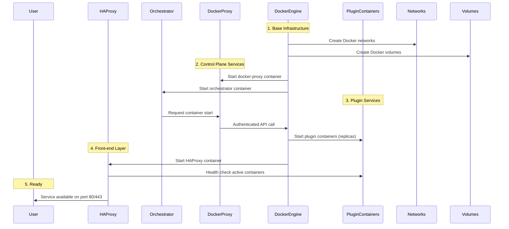
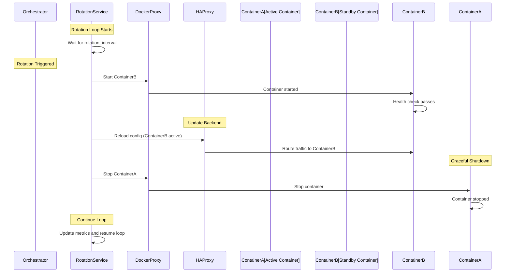
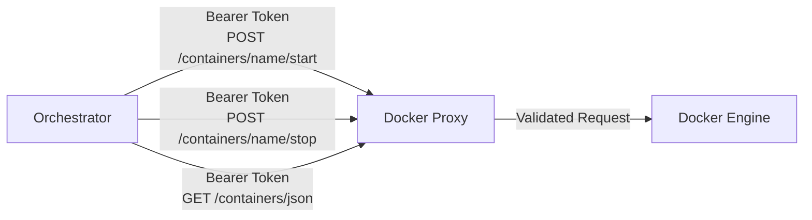

# Leyzen Vault Architecture

**Note for developers**: This document provides detailed technical architecture documentation for developers and contributors. For a user-friendly overview, see the [GitHub Wiki Architecture page](https://github.com/3xpyth0n/leyzen-vault/wiki/Architecture).

This document describes the high-level architecture of Leyzen Vault, including service components, startup order, container rotation flow, and inter-component communication.

## Overview

Leyzen Vault is a modular moving-target defense orchestrator that automatically rotates web service containers to reduce attack surface and minimize exposure time. The system consists of:

- **HAProxy**: Reverse proxy and load balancer front-end
- **Orchestrator**: Flask application managing container rotation and dashboard
- **Docker Proxy**: Authenticated broker for Docker Engine API
- **Plugins**: Service-specific integrations (Filebrowser, Paperless-ngx, etc.)
- **Base Infrastructure**: Docker networks and volumes

## Architecture Diagram


## Service Startup Order

Services must start in a specific order to ensure dependencies are available:



### Detailed Startup Sequence

1. **Base Infrastructure** (Docker Compose)
   - Create Docker networks (`vault_network`)
   - Create Docker volumes (plugin-specific volumes)

2. **Control Plane Services**
   - `docker-proxy` starts first (required by orchestrator)
   - `orchestrator` starts and connects to docker-proxy

3. **Plugin Services** (Managed by orchestrator)
   - Orchestrator reads `VAULT_WEB_CONTAINERS` from environment
   - Starts plugin containers up to configured replica count
   - Waits for containers to be healthy

4. **Front-end Layer**
   - `haproxy` starts last
   - Connects to active containers via backend configuration
   - Begins serving traffic on configured ports

## Container Rotation Flow

The orchestrator continuously rotates containers according to the configured interval:



### Rotation Details

1. **Timing**: Rotation occurs at intervals defined by `VAULT_ROTATION_INTERVAL`
2. **Health Checks**: New containers must pass health checks before traffic is switched
3. **Graceful Shutdown**: Old containers are stopped after a grace period
4. **Metrics**: Rotation events and container statistics are logged and exposed via SSE

## Component Communication

### Orchestrator ↔ Docker Proxy

The orchestrator communicates with the Docker proxy via authenticated HTTP:

- **Authentication**: Bearer token (`DOCKER_PROXY_TOKEN`)
- **Endpoints**: Limited to allowlisted container lifecycle operations
- **Protocol**: HTTP REST API (default: `http://docker-proxy:2375`)



### HAProxy ↔ Plugin Containers

HAProxy acts as a reverse proxy and load balancer:

- **Backend Configuration**: Dynamically updated during rotation
- **Health Checks**: Periodic checks ensure only healthy containers receive traffic
- **Routing**: Requests are forwarded to the currently active container(s)

### Orchestrator ↔ Dashboard Users

The orchestrator serves a web dashboard with real-time updates:

- **Server-Sent Events (SSE)**: Streams rotation metrics and container status
- **Authentication**: Session-based authentication with CAPTCHA and rate limiting
- **API Endpoints**: RESTful endpoints for rotation control and metrics

## Data Flow

### Request Flow

```
User Request → HAProxy → Active Container → Response → HAProxy → User
```

### Rotation Control Flow

```
Orchestrator → Docker Proxy → Docker Engine → Container Lifecycle Events
     ↓
HAProxy Config Update → Traffic Redirect
```

### Metrics Flow

```
Container Stats → Docker Proxy → Orchestrator → Telemetry Service → SSE Stream → Dashboard
```

## Security Considerations

- **Isolation**: Containers run in isolated Docker networks
- **Authentication**: Docker proxy enforces bearer token authentication
- **Allowlisting**: Only specific container operations are permitted
- **Rate Limiting**: Dashboard authentication includes rate limiting
- **Secret Rotation**: Secrets can be rotated without service downtime

## Plugin Architecture

Plugins extend Leyzen Vault with new service types:

- **Base Class**: `VaultServicePlugin` in `src/vault_plugins/__init__.py`
- **Configuration**: Each plugin defines Docker Compose fragments
- **Replicas**: Plugin defines `min_replicas` (default enforced via `VAULT_WEB_REPLICAS`)
- **Dependencies**: Plugins can declare service dependencies (e.g., PostgreSQL, Redis)

See individual plugin documentation for service-specific details.

## Configuration Management

Configuration is centralized via environment variables:

- **Source**: `.env` file (generated from `env.template`)
- **Validation**: `leyzenctl config validate` checks configuration integrity
- **Generation**: `leyzenctl build` generates `docker-compose.yml` from template
- **Secrets**: Cryptographic secrets must meet minimum length requirements

For detailed configuration options, see `env.template` and `docs/SECURITY.md`.
