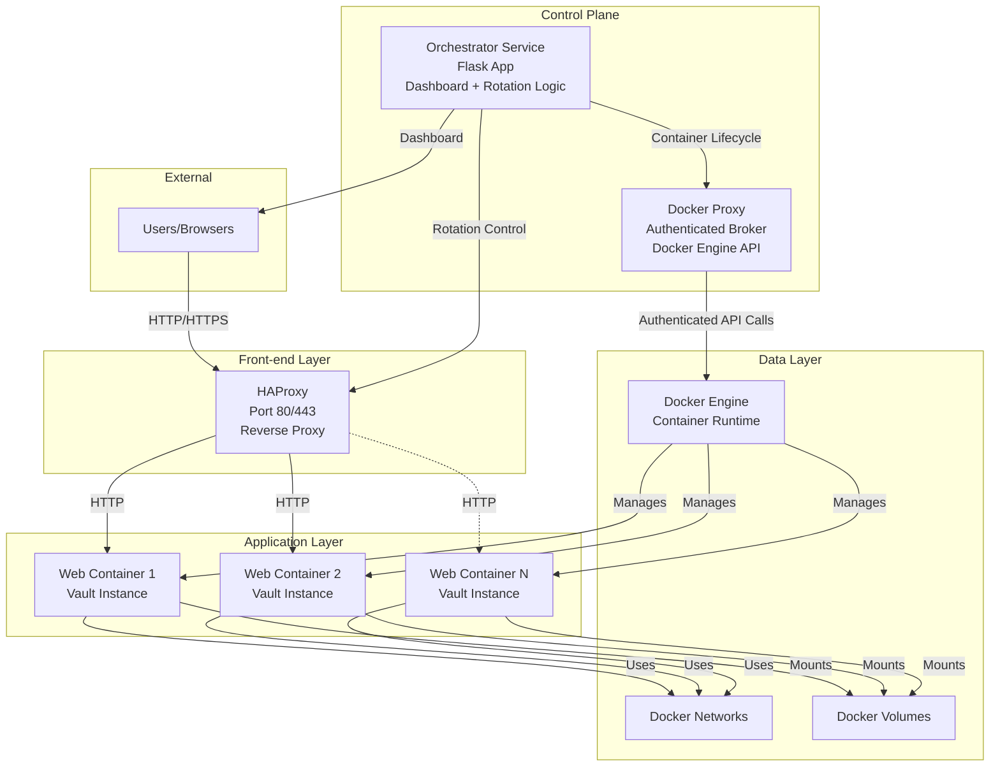
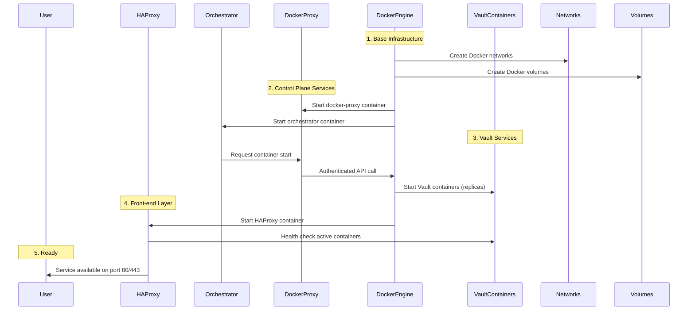
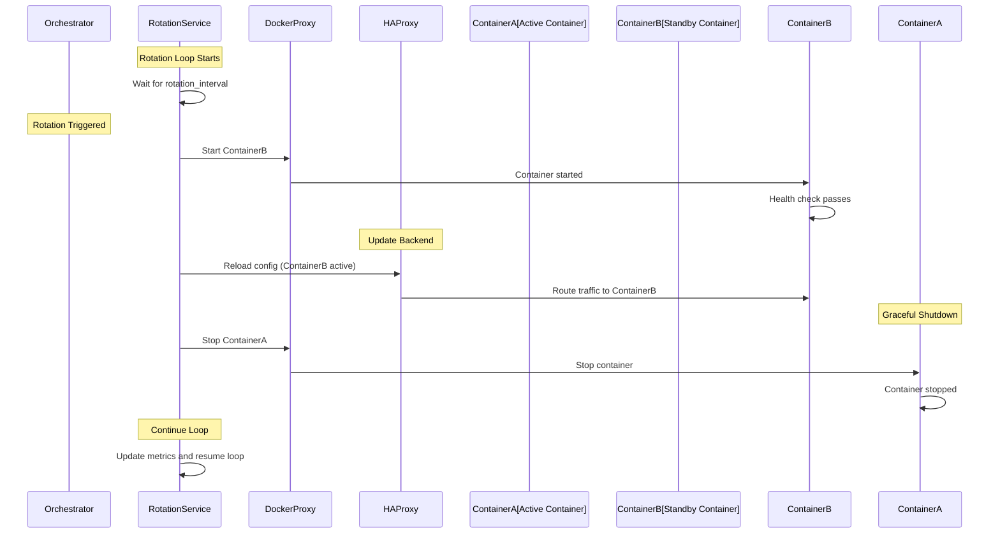
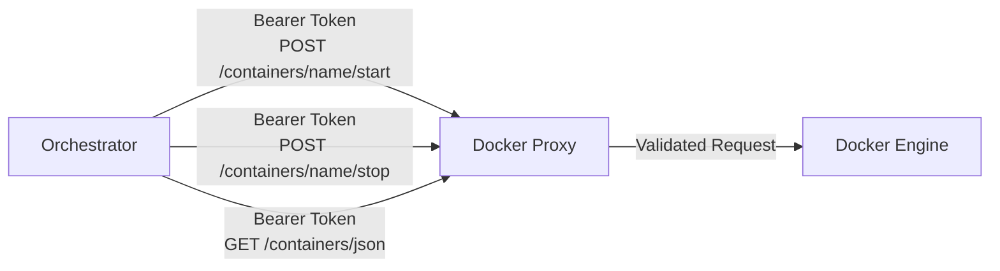

# Leyzen Vault Architecture

**Note for developers**: This document provides detailed technical architecture documentation for developers and contributors. For a user-friendly overview, see the [Architecture Overview](https://docs.leyzen.com/architecture/overview) page.

This document describes the high-level architecture of Leyzen Vault, including service components, startup order, container rotation flow, and inter-component communication.

## Overview

Leyzen Vault is a modular moving-target defense orchestrator that automatically rotates web service containers to reduce attack surface and minimize exposure time. The system consists of:

- **HAProxy**: Reverse proxy and load balancer front-end
- **Orchestrator**: Flask application managing container rotation and dashboard
- **Docker Proxy**: Authenticated broker for Docker Engine API
- **Vault**: Secure file storage application with end-to-end encryption (E2EE), Vue.js SPA frontend, and REST API v2
- **PostgreSQL**: Database for all metadata, users, vaultspaces, and system data
- **Base Infrastructure**: Docker networks and volumes

## Architecture Diagram



## Service Startup Order

Services must start in a specific order to ensure dependencies are available:



### Detailed Startup Sequence

1. **Base Infrastructure** (Docker Compose)
   - Create Docker networks (`vault_network`)
   - Create Docker volumes (Vault-specific volumes)

2. **Control Plane Services**
   - `docker-proxy` starts first (required by orchestrator)
   - `orchestrator` starts and connects to docker-proxy

3. **Vault Services** (Managed by orchestrator)
   - Orchestrator reads container names from environment (injected by docker-compose)
   - Container names are auto-generated from `WEB_REPLICAS` if not provided
   - Starts Vault containers up to configured replica count
   - Waits for containers to be healthy

4. **Front-end Layer**
   - `haproxy` starts last
   - Connects to active containers via backend configuration
   - Begins serving traffic on configured ports

## Container Rotation Flow

The orchestrator continuously rotates containers according to the configured interval:



### Rotation Details

1. **Timing**: Rotation occurs at intervals defined by `ROTATION_INTERVAL`
2. **Health Checks**: New containers must pass health checks before traffic is switched
3. **Graceful Shutdown**: Old containers are stopped after a grace period
4. **Metrics**: Rotation events and container statistics are logged and exposed via SSE

## Component Communication

### Orchestrator ↔ Docker Proxy

The orchestrator communicates with the Docker proxy via authenticated HTTP:

- **Authentication**: Bearer token (`DOCKER_PROXY_TOKEN`)
- **Endpoints**: Limited to allowlisted container lifecycle operations
- **Protocol**: HTTP REST API (default: `http://docker-proxy:2375`)



### HAProxy ↔ Vault Containers

HAProxy acts as a reverse proxy and load balancer:

- **Backend Configuration**: Dynamically updated during rotation
- **Health Checks**: Periodic checks ensure only healthy containers receive traffic
- **Routing**: Requests are forwarded to the currently active container(s)

### Orchestrator ↔ Dashboard Users

The orchestrator serves a web dashboard with real-time updates:

- **Server-Sent Events (SSE)**: Streams rotation metrics and container status
- **Authentication**: Session-based authentication with CAPTCHA and rate limiting
- **API Endpoints**: RESTful endpoints for rotation control and metrics

## Data Flow

### Request Flow

```
User Request → HAProxy → Active Container → Response → HAProxy → User
```

### Rotation Control Flow

```
Orchestrator → Docker Proxy → Docker Engine → Container Lifecycle Events
     ↓
HAProxy Config Update → Traffic Redirect
```

### Metrics Flow

```
Container Stats → Docker Proxy → Orchestrator → Telemetry Service → SSE Stream → Dashboard
```

## Service Dependencies and Startup Order

The services in Leyzen Vault have specific dependencies that determine the startup order:

### Dependency Graph

```
HAProxy (no dependencies)
    ↓
PostgreSQL (no dependencies)
    ↓
Vault Web Containers (depend on: HAProxy healthy, PostgreSQL healthy)
    ↓
Docker Proxy (no dependencies, but must be healthy before orchestrator)
    ↓
Orchestrator (depends on: all Vault web containers started, Docker Proxy healthy)
```

### Service Dependencies

1. **PostgreSQL** (v2.0.0+):
   - No dependencies
   - Starts first as the database backend
   - Must be healthy before vault containers can start (they require database access)
   - Stores all metadata, users, vaultspaces, and system data

2. **HAProxy**:
   - No dependencies (but should start after PostgreSQL for proper health checks)
   - Starts early as the front-end reverse proxy
   - Must be healthy before vault containers can receive traffic

3. **Docker Proxy**:
   - No dependencies
   - Starts early and must be healthy before orchestrator starts
   - Provides authenticated access to Docker Engine API

4. **Vault Web Containers** (vault_web1, vault_web2, etc.):
   - Depend on: PostgreSQL (service_healthy), HAProxy (service_healthy)
   - Start after PostgreSQL and HAProxy are ready
   - Require PostgreSQL for all operations (authentication, file metadata, etc.)
   - Receive traffic from HAProxy once healthy
   - Serve Vue.js SPA frontend and REST API v2

5. **Orchestrator**:
   - Depends on: All vault web containers (service_started), Docker Proxy (service_healthy)
   - Starts last, after all other services are ready
   - Coordinates container rotation and requires access to both vault containers and docker-proxy

### Startup Sequence

1. **Phase 1**: PostgreSQL starts first (no dependencies, required by vault containers)
2. **Phase 2**: HAProxy and Docker Proxy start simultaneously (no dependencies, but must become healthy)
3. **Phase 3**: Vault web containers start after PostgreSQL and HAProxy are healthy
4. **Phase 4**: Orchestrator starts after all vault containers are started and docker-proxy is healthy

This dependency chain ensures that:

- The front-end (HAProxy) is ready to route traffic
- The database (PostgreSQL) is available for vault containers
- The control plane (orchestrator + docker-proxy) can manage container lifecycle
- Container rotation can begin only after all services are operational

## Security Considerations

- **Isolation**: Containers run in isolated Docker networks
- **Authentication**: Docker proxy enforces bearer token authentication
- **Allowlisting**: Only specific container operations are permitted
- **Rate Limiting**: Dashboard authentication includes rate limiting
- **Secret Rotation**: Secrets can be rotated without service downtime

## Configuration Management

Configuration is centralized via environment variables:

- **Source**: `.env` file (generated from `env.template`)
- **Validation**: `leyzenctl config validate` checks configuration integrity
- **Generation**: `leyzenctl build` generates `docker-generated.yml` from template
- **Secrets**: Cryptographic secrets must meet minimum length requirements

For detailed configuration options, see `env.template` and `docs/SECURITY.md`.

## Database Schema

Leyzen Vault v2.0.0 uses PostgreSQL for all data storage (files, audit logs, share links, users, vaultspaces, file versions, webhooks, workflows, SSO providers, devices, invitations, etc.). The PostgreSQL implementation uses native TIMESTAMP WITH TIME ZONE for timezone-aware timestamps.

**Note**: Version 2.0.0 requires PostgreSQL 16 for production deployments. The database schema is automatically created on first startup using SQLAlchemy ORM. All metadata, user data, and system data are stored in PostgreSQL, while encrypted file data is stored in tmpfs volumes and persistent storage volumes.

### Schema Management Strategy

**Current Approach**: Schema creation is handled automatically by SQLAlchemy:

- PostgreSQL models are defined in `src/vault/database/schema.py`
- Tables are created automatically on first startup using SQLAlchemy's `db.create_all()`
- `init_db()` is called during application initialization and creates all tables if they don't exist
- No manual migrations are required - the schema is defined in code and created automatically

**Schema Definition**:

- All models are defined using SQLAlchemy ORM in `src/vault/database/schema.py`
- Tables are created automatically when the application starts for the first time
- Schema changes require updating the model definitions and restarting the application
- Development/testing environments can reset the database by dropping and recreating PostgreSQL tables

### Timestamp Storage

Timestamps are stored as `TIMESTAMP WITH TIME ZONE` in PostgreSQL:

- **Pros**: Timezone-aware, efficient for date-based queries, native database support
- **Cons**: Requires timezone-aware datetime objects in Python code

Indexes are created on timestamp columns to improve query performance.

## Volume Management and Monitoring

### Temporary File System (tmpfs) Volumes

Leyzen Vault uses tmpfs volumes for ephemeral container data storage. These volumes are stored in memory and provide fast, secure storage that is automatically cleared when containers are rotated.

#### Volume Configuration

- **Type**: tmpfs (in-memory filesystem)
- **Size**: 1GB per container (configurable in `docker-generated.yml`)
- **Mount Options**: `noexec,nosuid,nodev` for security
- **Purpose**: Store encrypted files temporarily during container lifecycle

#### Monitoring and Alerts

**Important**: tmpfs volumes can be filled, which may cause service disruption. It is essential to monitor volume usage and set up alerts.

##### Monitoring Volume Usage

1. **Check volume usage**:

   ```bash
   docker system df -v
   ```

2. **Monitor specific volume**:

   ```bash
   docker volume inspect vault-data-web1
   ```

3. **Check container disk usage**:
   ```bash
   docker exec vault_web1 df -h /data
   ```

##### Recommended Alerts

Set up monitoring alerts for the following conditions:

- **Volume usage > 80%**: Warning alert
- **Volume usage > 95%**: Critical alert
- **Container rotation failures**: May indicate volume issues
- **File upload failures**: May indicate volume full condition

##### Monitoring Tools

- **Docker monitoring**: Use Docker's built-in monitoring or tools like Prometheus
- **Log monitoring**: Monitor application logs for volume-related errors
- **Health checks**: Ensure health checks include volume availability checks

##### Response Procedures

If a tmpfs volume becomes full:

1. **Immediate**: Check current volume usage
2. **Short-term**: Increase volume size in `docker-generated.yml` if needed
3. **Long-term**: Review file retention policies and cleanup procedures
4. **Prevention**: Implement automated cleanup of old files

##### Configuration

Volume configuration is defined in `docker-generated.yml` (generated by `src/compose/build.py`):

```yaml
volumes:
  vault-data-web1:
    driver: local
    driver_opts:
      type: tmpfs
      device: tmpfs
      options: size=1G,noexec,nosuid,nodev
```

To adjust volume size, modify the `size` option in the volume definition and regenerate `docker-generated.yml`.

##### Best Practices

- **Regular monitoring**: Check volume usage daily in production
- **Automated alerts**: Set up alerts for volume usage thresholds
- **Capacity planning**: Estimate storage needs based on usage patterns
- **Cleanup procedures**: Implement automated cleanup of old files
- **Documentation**: Document volume monitoring procedures for operators
